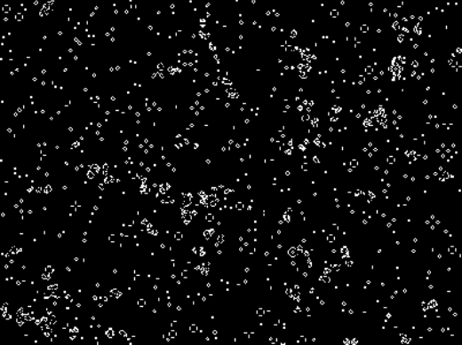

# Cellular Automata and The Game of Life

## Objectives

* Learn what cellular automata are and how they are useful in real life
* Learn what the rules of the Game of Life are
* Learn how Conway's life is Turing Complete
* Explore Life Examples website

# Cellular Automata

A _cellular automaton_ (plural: cellular automata, abbreviated _CA_) is a
program that operates on data typically stored in a 2D grid. (1D, 3D and _n_-D
cellular automata run on lines, cubes, etc.)

A simple set of rules describes how the value in a cell on the grid changes over
time, often as the result of the states of that cell's neighbors.

> Sometimes neighbors includes the 4 orthogonally adjacent cells; sometimes it
> includes all 8 surrounding cells including diagonals.

Each round of the simulation examines the current state of the grid, and then
produces an entirely new grid consisting of the old state. (Remember the
discussion about double buffers earlier--we don't want to modify the same grid
we're examining, lest we munge future results.)

This new grid becomes the "current" state of the simulation, and the process
repeats. Each new grid is referred to as a _generation_.

The beautiful thing about cellular automata is that sometimes very complex
behavior can emerge from very simple rules.

Practically speaking, CAs have been used in biological and chemical simulation
and other areas of research, such as CA-based computer processors, and other
numeric techniques.

## The Game of Life

A very famous cellular automaton is John Conway's [Game of
Life](https://en.wikipedia.org/wiki/Conway%27s_Game_of_Life).
app. This game is a class of discrete model known as a *[Cellular
Automaton](https://en.wikipedia.org/wiki/Cellular_automaton)*, abbreviated *CA*.

It's made up of a grid of cells (usually 2D, but can be any dimension)
that follow a simple set of rules from which complex behaviors can
emerge.

In the grid, below, white pixels are alive, and black pixels are dead.

In the Game of Life, these rules examine each cell of the grid. For each
cell, it counts that cell's eight neighbors (up, down, left, right, and
diagonals), and then act on that result.

* If the cell is alive **and** has 2 or 3 neighbors, then it remains
  alive. Else it dies.
* If the cell is dead **and** has exactly 3 neighbors, then it comes to
  life. Else if remains dead.

From those two rules, many types of "creatures" can be created that
[move around the
"landscape"](https://www.youtube.com/watch?v=28vxPvTDh4E).

Note: cells that are off the edge of the grid are typically assumed to
be dead. (In other cases, people sometimes code it up to wrap around to
the far side.)

## Turing Completeness

We say a computing system is [_Turing
Complete_](https://en.wikipedia.org/wiki/Turing_completeness) if it is capable
of performing arbitrary, general purpose computation.

Using a construct in The Game of Life called a [glider
gun](https://en.wikipedia.org/wiki/Gun_(cellular_automaton)), it's possible to
build a rudimentary [NAND gate](https://en.wikipedia.org/wiki/NAND_gate) in the
Game of Life. While a NAND gate by itself isn't enough to be Turing Complete,
the "infinite" grid of The Game of Life allows you to use them (or any other
[functionally complete](https://en.wikipedia.org/wiki/Functional_completeness)
operator) to build any other type of logical "circuitry" and
[memory](https://en.wikipedia.org/wiki/Flip-flop_(electronics)), as well.

Anything computable can be computed in The Game of Life given a large enough
grid and enough time. Most people, however, find JavaScript to be a far easier
development medium.

## References

* [John Conway's Game of
Life](https://en.wikipedia.org/wiki/Conway%27s_Game_of_Life)
* [`requestAnimationFrame()`](https://developer.mozilla.org/en-US/docs/Web/API/window/requestAnimationFrame)

## Assignment

### Explore The Game of Life

* [Edwin Martin's Implementation](https://bitstorm.org/gameoflife/): run the
  simulation to see what the Game looks like.

* [Explore patterns on LifeWiki](http://www.conwaylife.com/wiki/Category:Patterns)
